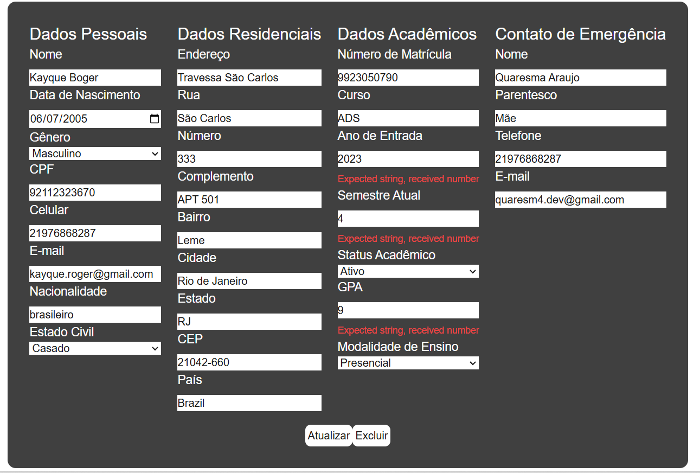

# Separando o Front-End e o Back-End: CRUD com Autenticação JWT

Este repositório contém a implementação de um desafio consiste em separar os sistemas anteriormente criados no [Desafio 02](https://github.com/qu4resm4/Academia-da-Inovacao/tree/main/desafio02).

## AVISO!
O formulário da página dashboard do usuário esta com um problema na validação dos campos, é necessário repreencher os campos "Ano de Entrada", "Semestre Atual" e "GPA" para o envio do formulário operar.



Possivelmente é consequência de alguma incompatibilidade dos tipos, os inputs ao serem preenchidos dinamicamente eles recebem os valores no tipo number, e a validação com o Zod recebe strings e transformam. 

## Descrição do Projeto
O desafio proposto para este projeto consiste em dividir o sistema proposto no [Desafio 02](https://github.com/qu4resm4/Academia-da-Inovacao/blob/main/desafio02/README.md#desafio-proposto) em dois sistemas diferentes, uma para oferecer os serviços e a persistência dos dados, uma API Rest utilizando o framework Nest e o um para oferencer a interface de usuário dinâmica utilizando o framework Next.

## Tecnologias Utilizadas

### Frontend:
- Next.js
- zod
- useForm
- js-cookies
- jwtdecode

### Backend:
- Nest.js
- class-validator
- passport
- PrismaORM
- PostgreSQL

## Como Testar

### Frontend:
#### Requisitos:
- Node.js
- npm

#### Passos:
1. Navegue até o diretório do frontend:
   ```bash
   cd client
   ```
   
2. Instale as dependências necessárias:
   ```bash
   npm install
   ```

3. Inicie o servidor de desenvolvimento:
   ```bash
   npm run dev
   ```
   
4. Acesse a UI no navegador:
   Abra [http://localhost:3000](http://localhost:3000) para interagir com a API.

### Backend:
#### Requisitos:
- Node.js
- npm
- PostgreSQL configurado

#### Passos:
1. Configure o banco de dados:
   - Crie um banco de dados PostgreSQL.
   - Altere as informações de conexão no arquivo `.env`.

2. Navegue até o diretório do backend
   ```bash
     cd api
   ```

3. Instale as dependências necessárias:
   ```bash
     npm install
   ```

4. Migre o schema para o banco de dados:
   ```bash
     npx prisma migrate deploy
   ```

5. Gere o Prisma Client:
   ```bash
      npx prisma generate
   ```

6. Inicie o servidor:
   ```bash
     nest start
   ```

7. Acesse a API no navegador:
   Abra [http://localhost:4000](http://localhost:4000) para interagir com a API.
